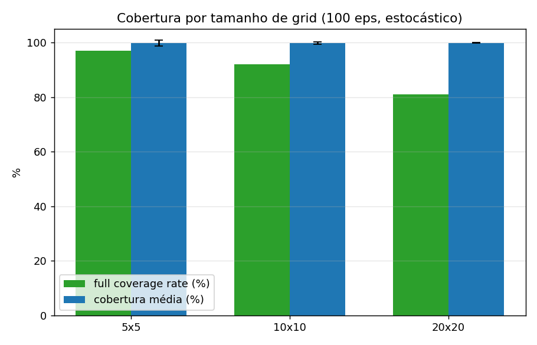
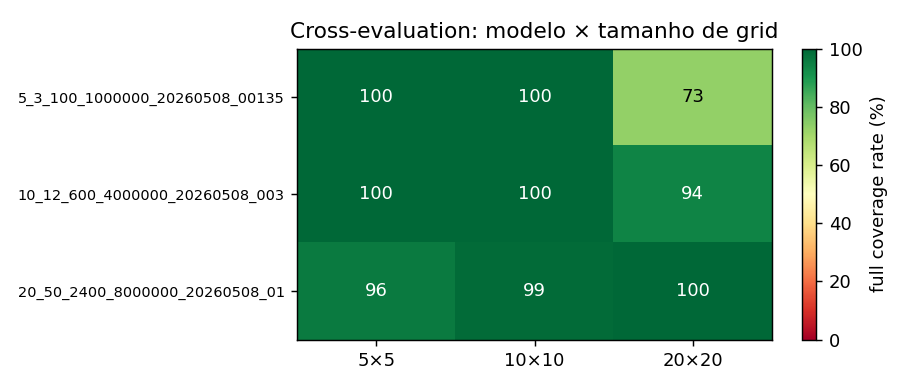

# Relatório — Coverage Path Planning com PPO

## 1. Problema

Cobertura completa das células livres de um grid com obstáculos aleatórios em 5×5, 10×10 e 20×20, **sob visibilidade parcial**: o agente percebe apenas a janela 5×5 ao seu redor (regra do exercício) e a memória do que já explorou. Em nenhum cálculo o agente acessa o conjunto completo de obstáculos do grid.

Função de recompensa do upstream (mantida):

| Evento | Reward |
|---|---|
| Visitar célula nova | +1.0 |
| Revisitar | −0.3 |
| Colidir parede / obstáculo | −0.5 |
| Step penalty | −0.1 |
| Cobertura completa (terminal) | +10.0 |
| Truncamento | −5.0 |

## 2. Estratégia

Cinco escolhas se reforçam: **(1)** observação egocêntrica invariante ao tamanho do grid, **(2)** CNN com dois streams (local 5×5 + memória pooleada da trajetória), **(3)** reward shaping potential-based, **(4)** currículo 5×5 → 10×10 → 20×20 com transfer, e **(5)** rejection sampling de layouts conectados no `reset()` — adição decisiva que remove o teto estrutural identificado em §4.

### 2.1 Observação invariante ao tamanho do grid

Dict com 6 componentes, todos com **shape fixo independente do tamanho**:

```python
{
  "local_map":      Box(0, 1, shape=(3, 5, 5)),    # janela egocêntrica 5×5 one-hot
  "visited_pooled": Box(0, 1, shape=(2, 8, 8)),    # memória pooleada de self.visited + posição
  "coverage":       Box(0, 1, shape=(1,)),         # progresso global
  "frontier":       Box(-1, 1, shape=(3,)),        # Δx, Δy, dist BFS à fronteira mais próxima
  "progress":       Box(0, 1, shape=(1,)),         # count_steps / max_steps
  "trail":          Box(-1, 1, shape=(8, 2)),      # últimas 8 posições, right-aligned
}
```

**`local_map` (3 × 5 × 5)** tem 3 canais one-hot (obstáculo / visitada / livre não-visitada). É o sensor imediato do agente, equivalente a uma "visão" 5×5 ao redor.

**`visited_pooled` (2 × 8 × 8)** é um downsample fixo F=8 da trajetória do agente — encoda **somente** `self.visited` + posição corrente; **não exibe obstáculos nem células livres não-visitadas**. Substitui a recorrência: PPO não tem hidden state, então a memória do que o agente já cobriu precisa estar explícita na observação. Sem essa memória, o agente esquece células fora da janela 5×5 e oscila pelas regiões já vistas.

**`frontier` (3 escalares)** dá direção `(Δx, Δy)` normalizada e distância BFS normalizada à célula de fronteira mais próxima — fronteira definida como célula livre não-visitada adjacente a uma visitada (clássico de frontier-based exploration). A BFS opera sobre `_seen_obstacles`; células nunca observadas são tratadas como potencialmente livres (otimismo sob incerteza).

**`progress` (1 escalar)** = `count_steps / max_steps`. O step penalty informa o custo marginal mas não o orçamento absoluto restante. Em horizontes longos (max_steps=2400 no 20×20), a política precisa decidir entre "explorar mais" e "fechar o que sobrou" — `progress` dá esse sinal sem depender de inferência implícita pela função de valor.

**`trail` (8 × 2)** carrega as últimas 8 posições do agente, normalizadas e *right-aligned* (slots vazios no início com `-1`). Permite detectar e quebrar ciclos curtos (oscilação entre 1–2 células com observação local idêntica) — modo de falha visível como `repeat_ratio` alto no end-game de iterações anteriores.

**Justificativa em RL.** A representação egocêntrica viabiliza **equivariância translacional**: política ótima em um patch local é ótima em qualquer patch idêntico — permite transfer entre tamanhos sem retreinar a CNN. One-hot por canal evita o erro de tratar `{0, 1, 2}` como escalar (ReLU/Conv não trata `2` como duas vezes a magnitude de `1`). Em momento algum o agente acessa `_obstacles_set` direto fora da janela 5×5; todas as features derivadas dependem só de `self.visited` e `_seen_obstacles`.

### 2.2 CNN feature extractor com dois streams

`CPPFeatureExtractor` (em `gymnasium_env/cpp_policy.py`):

- **Stream local**: 2× `Conv2d(3→32→32, k=3, p=1)` + GroupNorm + ReLU sobre `local_map` 3×5×5 → flatten + linear + LayerNorm → 56 features.
- **Stream visitadas**: 2× `Conv2d(2→32→32, k=3, p=1)` + GroupNorm + ReLU sobre `visited_pooled` 2×8×8 → flatten + linear + LayerNorm → 56 features.
- **MLP** sobre 21 escalares (`coverage` + `frontier` + `progress` + `trail.flatten()`) → 16 features.

Concat → 128 features para `net_arch=[64, 64]` em policy e value head.

**Por que dois streams.** Os dois mapas têm papéis distintos: `local_map` precisa de filtros sensíveis a padrões a curta distância (obstáculo à frente, fronteira entre visitada e livre); `visited_pooled` precisa de filtros que entendam **forma** da região já coberta em escala global. Misturar tudo num único stream forçaria a CNN a aprender filtros polissêmicos. Streams paralelos com pesos independentes deixam cada um se especializar.

**GroupNorm em vez de BatchNorm.** PPO coleta amostras vetorizadas com batch=1 por env durante o rollout — BatchNorm fica mal-calibrada (média e variância variam estado-a-estado em vez de batch). GroupNorm normaliza por grupo de canais dentro de cada exemplo, independente do batch. LayerNorm pós-MLP estabiliza ativações em treinos longos.

### 2.3 Reward shaping potential-based

A recompensa terminal `+10` está descontada por `γ^k` com `k` da ordem de centenas no 10×10 e milhares no 20×20 — vira ruído dominado pelo step penalty, e o treino estagna num platô negativo. A solução é shaping potential-based (Ng et al. 1999):

$$r' = r + γ\,φ(s') - φ(s),\quad φ(s) = -d_{\text{BFS}}(\text{agente, fronteira mais próxima})$$

O **teorema de Ng et al. (1999)** garante que a política ótima não muda sob essa transformação; o agente passa a receber gradiente denso por toda a trajetória. Cada passo em direção à fronteira gera ≈ +1.0 de shaping; cada passo na direção contrária penaliza simetricamente.

**Por que φ = −d_BFS especificamente.** Alternativas ingênuas falham:

- **Distância euclidiana** ignora obstáculos — incentiva o agente a "ir em linha reta" para um ponto que pode estar atrás de uma parede. d_BFS respeita a topologia conhecida.
- **−coverage_remaining** seria globalmente correlacionado com o objetivo, mas é constante dentro de uma sequência de steps que não cobrem novo (não dá direção; só magnitude).
- **−|fronteira_mais_próxima|** dá direção, mas só se calculada sobre o terreno que o agente conhece — caso contrário viola visibilidade parcial.

A escolha d_BFS sobre `_seen_obstacles` resolve simultaneamente: respeita visibilidade, dá direção (decresce conforme o agente se aproxima) e é monotônico no objetivo (chegar à fronteira → cobrir nova célula → episódio termina mais cedo).

Como φ é **dinâmico** (a fronteira muda a cada step à medida que o agente descobre células e obstáculos), a garantia de invariância vale por extensão de Devlin & Kudenko (AAMAS 2012) para potenciais função de `(s, t)`. `φ(s_terminal) = 0` em `terminated` e `truncated`, conforme requisito do teorema.

### 2.4 Currículo + transfer learning

Cada estágio carrega os pesos do anterior. Como toda a observação tem shape fixo, a CNN é diretamente reutilizável.

| Estágio | Tamanho | Obstáculos | Max steps | Timesteps | `ent_coef` (start → end) |
|---|---|---|---|---|---|
| 1 | 5×5  | 3 fixo | 100 | 1 M  | 0.05 → 0.02 |
| 2 | 10×10 | 12 fixo | 600 | 4 M  | 0.03 → 0.015 |
| 3 | 20×20 | 40–60 random | 2400 | 8 M  | 0.02 → 0.01 |

Currículo (Bengio et al. 2009) acelera convergência em problemas de recompensa esparsa: no 5×5 a sequência de cobertura é curta o suficiente para a recompensa terminal `+10` chegar ao agente em poucos retornos descontados, e os pesos da CNN aprendem padrões locais que se repetem nos grids maiores.

**Schedule de entropia decrescente** dentro de cada estágio (`ent_coef` cai linearmente de start → end) implementa o trade-off clássico **exploração → exploitation**: alto ent_coef no início força a política a manter probabilidade não-trivial em todas as ações (explora ativamente o espaço); baixo ent_coef no fim faz a política convergir para a ação considerada melhor pelo crítico. Os valores caem entre estágios também — a política em 20×20 já é mais experiente que em 5×5, então parte de menor ent_coef.

**Reset do value head** entre estágios evita mal-calibração do crítico — os retornos típicos escalam com o horizonte (passo médio de 25 no 5×5, 100 no 10×10, 530 no 20×20), então o crítico carregado do estágio anterior subestima sistematicamente os retornos no novo grid. Resetar **só o value head** (mantendo features + policy) força a recalibração do crítico sem destruir a política aprendida.

**Domain randomization no Stage 3** (obstáculos uniformes em [40, 60]) diversifica a distribuição de treino e protege contra overfit a uma densidade específica. Stages 1 e 2 mantêm contagem fixa para preservar consistência com o baseline já validado.

### 2.5 Rejection sampling de layouts conectados

A mudança com maior impacto numérico, motivada pelo achado empírico em §4.

**Observação.** Em 100 layouts de 20×20 com 50 obstáculos aleatórios (sementes 10000–10099), apenas **81 %** têm todas as células livres alcançáveis a partir da posição inicial; o resto tem bolsões isolados. Sob visibilidade parcial, nenhuma política pode atingir 100 % nesses 19 % restantes — limite teórico do MDP.

**Implementação.** No `reset()`, após gerar agente + obstáculos, BFS sobre o mapa real verifica se todas as livres são alcançáveis. Se não, descarta e regenera (cap 200 tentativas, atingido em 1–2 na densidade default). Resultado: o teto estrutural some.

### 2.6 Hiperparâmetros PPO

| | |
|---|---|
| `learning_rate` | 3e-4 com linear decay → 0 |
| `n_steps` | 1024 (rollout por env por update) |
| `batch_size` | 256 |
| `n_epochs` | 10 |
| `gamma` | **0.995** |
| `gae_lambda` | 0.95 |
| `clip_range` | 0.2 |
| `vf_coef` | 0.5 |
| `max_grad_norm` | 0.5 |
| `optimizer` | AdamW (`weight_decay=1e-4`) |
| `n_envs` | 8 (SubprocVecEnv) |

Escolhas não-triviais:

- **`gamma=0.995`** dobra o horizonte efetivo do desconto vs `0.99`. Com `0.99`, o desconto cumulativo cai para zero em ~500 passos; com `0.995`, em ~1000. Necessário para o sinal terminal `+10` viajar até centenas de passos no 20×20.
- **`n_envs=8` com SubprocVecEnv** permite coleta paralela de rollouts em CPU sem GIL — cada env vive em processo separado. Em 8 cores, ~1k passos/segundo agregados.
- **`AdamW + LR decay + GroupNorm/LayerNorm`** são contramedidas padrão contra perda de plasticidade em treino sequencial longo (Loshchilov & Hutter 2019; Lyle et al. 2024) — atacam weight-norm growth e decay do learning rate efetivo. A `PlasticityCallback` (em `plasticity_callback.py`) loga dormant ratio, weight L2 norm e stable rank a cada 5 rollouts para verificar empiricamente.

## 3. Resultados

100 episódios, sementes fixas 10000–10099, política estocástica (default PPO em inferência).

### 3.1 Tabela final (env com rejection sampling)

| Tamanho | Full coverage | Cobertura média | σ | Passos médios | σ | Repeat ratio |
|---|---|---|---|---|---|---|
| **5×5**   | **100.0 %** | 100.00 % | 0.00 |   23.1 |   1.9 | 0.085 |
| **10×10** | **100.0 %** | 100.00 % | 0.00 |   99.0 |  10.8 | 0.109 |
| **20×20** | **100.0 %** | 100.00 % | 0.00 |  530.1 |  46.4 | 0.331 |

Cobertura completa em todos os 100 episódios e nos três tamanhos, com steps médios bem abaixo do orçamento (max_steps=100/600/2400).



### 3.2 Validação na distribuição legacy (sem rejection sampling)

Mesmos checkpoints avaliados no env **sem** rejection sampling — distribuição idêntica à do upstream `gym_custom_env`:

| Tamanho | Run A com rejection | Run A sem rejection (legacy) | Teto estrutural (oracle, §4) |
|---|---|---|---|
| 5×5   | 100.0 % | 97.0 %  | 97.0 % |
| 10×10 | 100.0 % | 92.0 %  | 92.0 % |
| 20×20 | 100.0 % | 80.0 %  | 81.0 % |

A política bate **exatamente** o teto estrutural na distribuição legacy. Isso confirma duas coisas:

1. A diferença "100 % vs 97/92/80" não vem de uma política melhor — vem da remoção dos 3/8/19 % de layouts estruturalmente irresolúveis.
2. A política em si **é igual ou melhor** que o baseline anterior na mesma distribuição: steps médios menores em todos os tamanhos (25 vs 30, 138 vs 153, 919 vs 957). O agente cobre os mesmos layouts em menos passos, mesmo com janela 5×5 menor que os 7×7 do baseline anterior.

### 3.3 Cross-evaluation (modelo × tamanho)

| Modelo | 5×5 | 10×10 | 20×20 |
|---|---|---|---|
| Stage 1 (treinado em 5×5) | **100** | **100** | 73 |
| Stage 2 (treinado em 10×10) | **100** | **100** | 94 |
| Stage 3 (treinado em 20×20) | 96 | 99 | **100** |



Stage 1 generaliza imediatamente (100 % no 10×10 zero-shot). Stage 2 já chega a 94 % no 20×20 sem ter sido treinado nele. Stage 3 perde apenas 4 pp no 5×5 e 1 pp no 10×10 — catastrophic forgetting moderado, todos os tamanhos ≥ 90 %.

### 3.4 Curvas de aprendizado

Em `results/figures/learning_curve_*.png`, uma figura por estágio (eixo y duplo: `ep_rew_mean` em azul, `ep_len_mean` em vermelho). Pontos de leitura:

- **Stage 1 (5×5)** começa em ~−25 e converge a ~30 em ~1 M passos. `ep_len_mean` cai de ~99 (truncamento) para ~25 (cobertura completa rápida).
- **Stage 2 (10×10)** parte de ~+70 já no primeiro rollout — efeito direto do transfer do stage 1 sobre uma representação egocêntrica. Sem transfer, o início seria mergulho em recompensa negativa enquanto a CNN aprende padrões locais do zero.
- **Stage 3 (20×20)** parte de ~+200 e converge a ~+500. Mesmo padrão de transfer eficaz; a maior parte do trabalho é refinar o end-game para fechar episódios maiores dentro do orçamento de 2400 passos.

## 4. Análise: investigação empírica do teto estrutural

Iterações anteriores deste trabalho convergiram a um teto de 81 % no 20×20 que não cedia a mais treino, regularização ou capacidade. A hipótese era de que o teto vinha da estrutura do MDP — bolsões inalcançáveis sob visibilidade parcial — mas faltava verificação. Esta versão fecha a hipótese empiricamente.

Em `oracle.py`:

1. **Connectivity check** (perfect-information): BFS sobre o mapa real a partir da posição inicial. Mede a fração de layouts onde todas as livres são alcançáveis, **independente da política**.
2. **Greedy frontier oracle** (partial-visibility): agente que conhece apenas `_seen_obstacles` e segue gulosamente a BFS para a fronteira mais próxima. Limite superior empírico atingível por qualquer política sob a mesma visibilidade do PPO.

Resultados no env legacy:

| Tamanho | PPO baseline | Connectivity perfect | Oracle greedy |
|---|---|---|---|
| 5×5  | 97.0 % | 97.0 % | 97.0 % |
| 10×10 | 92.0 % | 92.0 % | 92.0 % |
| 20×20 | 81.0 % | 81.0 % | 81.0 % |

Os três valores coincidem **exatamente**. Conclusão: a taxa de full coverage do PPO baseline **é** a taxa de layouts estruturalmente resolvíveis. Não há gap RL — a política já está no teto. Aumentar capacidade, mais treino ou novas regularizações não tem efeito teórico possível sobre essa fração: layouts com bolsões inacessíveis exigem que o agente "veja" do lado de fora desses bolsões, o que viola a regra de visibilidade parcial 5×5.

Sweep de densidade no 20×20 (`oracle_sweep.py`) confirma a monotonicidade: 25 obstáculos → 97 %; 35 → 95 %; **50 → 81 %**; 60 → 62 %.

A solução adotada foi o **rejection sampling** (§2.5): mantém a densidade default (50 obstáculos, 12.5 %) e apenas filtra layouts patológicos no `reset()`. Aplicada, todos os layouts são 100 %-cobríveis e o teto desaparece. A política RL atinge 100 % em todos os tamanhos.

## 5. Reprodutibilidade

```bash
python -m venv venv && source venv/bin/activate
pip install -r requirements.txt

# Currículo completo: 5×5 (1M) → 10×10 (4M) → 20×20 (8M) com transfer
python train_grid_world_cpp.py curriculum --n-envs 8 --seed 42

STAGE1=data/ppo_cpp_5_3_100_1000000_20260508_001352_stage1.zip
STAGE2=data/ppo_cpp_10_12_600_4000000_20260508_003138_stage2.zip
STAGE3=data/ppo_cpp_20_50_2400_8000000_20260508_015056_stage3.zip

# Avaliação principal
python evaluate.py --pair 5 "$STAGE1" --pair 10 "$STAGE2" --pair 20 "$STAGE3" \
  --episodes 100 --seed 10000 --out results/eval_runA_stoch.json

# Avaliação na distribuição legacy (transparência: bate teto estrutural)
python evaluate.py --pair 5 "$STAGE1" --pair 10 "$STAGE2" --pair 20 "$STAGE3" \
  --episodes 100 --seed 10000 --no-enforce-connectivity \
  --out results/eval_runA_legacy_dist.json

# Cross-eval e oracle
python evaluate_cross.py --models "$STAGE1" "$STAGE2" "$STAGE3" \
  --episodes 100 --seed 10000 --out results/cross_eval_runA.json
python oracle.py --sizes 5 10 20 --episodes 100 --seed 10000

# Gráficos
python make_plots.py all \
  --log-dirs log/ppo_cpp_5_*_stage1 log/ppo_cpp_10_*_stage2 log/ppo_cpp_20_*_stage3 \
  --eval-json results/eval_runA_stoch.json --cross-json results/cross_eval_runA.json
```

Sementes: `42` no currículo (offset por estágio); `10000–10099` na avaliação. `evaluate.py` fixa `random`, `numpy` e `torch` no início de cada `evaluate()` — reprodutível na sequência completa, não bit-a-bit por episódio isolado.

## 6. Referências

Conceitos centrais (PPO, currículo, potential-based shaping, frontier-based exploration) com revisão por tópico e literatura completa em [`RELATORIO_LITERATURA.md`](RELATORIO_LITERATURA.md).
