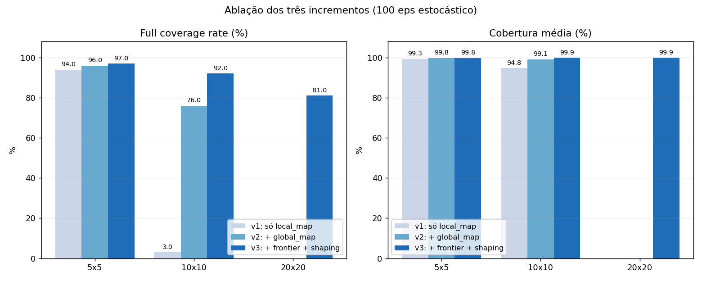
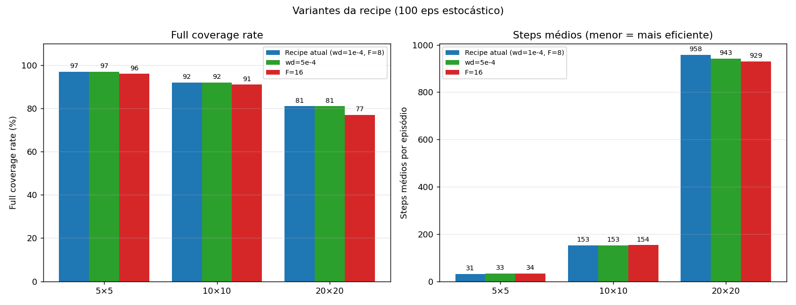

# Relatório — Coverage Path Planning com PPO

## 1. Problema

O agente precisa visitar todas as células livres de um grid com obstáculos no menor número de passos possível, **sob visibilidade parcial**: ele só percebe a vizinhança imediata e o histórico que ele mesmo coletou ao longo da exploração. Em nenhum momento o agente tem acesso ao mapa completo do ambiente — todas as decisões são tomadas sobre uma representação parcial construída a partir de duas fontes:

- o sensor imediato (janela ao redor do agente *agora*); e
- a memória persistente das células e obstáculos já vistos.

Cada episódio termina ao atingir cobertura completa ou ao estourar `max_steps`. A função de recompensa:

| Evento | Reward |
|---|---|
| Visitar célula nova | +1.0 |
| Revisitar célula | −0.3 |
| Colidir com parede / obstáculo | −0.5 |
| Step penalty | −0.1 |
| Cobertura completa (terminal) | +10.0 |
| Truncamento sem fechar | −5.0 |

O objetivo é treinar uma política que aprenda a cobrir grids de tamanhos crescentes (5×5, 10×10, 20×20) com cobertura próxima de 100 % e com o mínimo de revisitas, respeitando a observabilidade parcial.

## 2. Estratégia

A solução combina cinco escolhas que se reforçam: observação egocêntrica invariante ao tamanho do grid, CNN com dois streams (local e global), reward shaping potential-based, currículo crescente em tamanho do grid com transfer entre estágios, e mitigações contra perda de plasticidade.

### 2.1 Observação invariante ao tamanho do grid

A observação é um `Dict` com 4 componentes, todos com **shape fixo independente do tamanho do grid**:

```python
{
  "local_map":  Box(0, 1, shape=(3, 7, 7)),    # detalhe imediato (egocêntrico)
  "global_map": Box(0, 1, shape=(2, 8, 8)),    # memória persistente em resolução fixa
  "coverage":   Box(0, 1, shape=(1,)),         # progresso global
  "frontier":   Box(-1, 1, shape=(3,)),        # direção e distância à fronteira
}
```

**`local_map` (3, 7, 7)** — janela egocêntrica em torno do agente, 3 canais one-hot:

| Canal | Significado |
|---|---|
| 0 | obstáculo (incluindo *out-of-bounds*) |
| 1 | célula livre **já visitada** |
| 2 | célula livre **ainda não visitada** |

**`global_map` (2, 8, 8)** — mapa pooleado em resolução fixa F = 8:

| Canal | Significado |
|---|---|
| 0 | máscara de visitadas (max-pool: 1 se qualquer célula da região foi visitada) |
| 1 | posição corrente do agente (one-hot na célula pooleada) |

A resolução F é independente do tamanho do grid; cada célula pooleada cobre um número diferente de células reais por tamanho, mas o **shape do tensor é constante**, o que preserva a arquitetura entre estágios.

**`frontier` (3)** — direção `(Δx, Δy)` normalizada e distância BFS normalizada à célula de fronteira mais próxima, onde *fronteira* = célula livre não-visitada adjacente a uma célula visitada (definição clássica de frontier-based exploration em robótica). A BFS opera **apenas sobre o terreno conhecido pelo agente** (`visited ∪ ¬_seen_obstacles`), bloqueando só em obstáculos que o agente já viu pessoalmente; células nunca observadas são tratadas como potencialmente livres (otimismo sob incerteza).

**Justificativa em RL.** A política passa a ver o mundo a partir do referencial do agente, e a transição `s → s'` é a mesma em qualquer ponto do mapa onde a vizinhança local for igual — uma forma de **equivariância translacional**. Se a política for ótima em um patch local 7×7, ela continua ótima em outro patch idêntico em qualquer tamanho de grid, viabilizando transfer entre estágios sem retreinar a CNN do zero. A separação em canais one-hot resolve a confusão semântica de um encoding `{0, 1, 2}` (o ReLU/Conv não trata `2` como "duas vezes mais obstáculo que `1`"); o sinal fica linearmente separável.

**Visibilidade parcial preservada.** O `local_map` mostra apenas as 49 células ao redor do agente; o `global_map` carrega exclusivamente células visitadas; o `frontier` é derivado de uma BFS sobre o terreno conhecido. Em nenhum momento o agente acessa o conjunto completo de obstáculos do grid via observação ou cálculo derivado.

### 2.2 CNN feature extractor com dois streams

`gymnasium_env/cpp_policy.py` define `CPPFeatureExtractor`:

- **Stream local**: dois `Conv2d(3 → 32 → 32, kernel 3, padding 1)` + GroupNorm + ReLU sobre o `local_map` 3×7×7 → flatten → linear + LayerNorm → 56 features.
- **Stream global**: dois `Conv2d(2 → 32 → 32, kernel 3, padding 1)` + GroupNorm + ReLU sobre o `global_map` 2×8×8 → flatten → linear + LayerNorm → 56 features.
- **MLP** sobre os 4 escalares (coverage + frontier) → 16 features.
- Concatenação → 128 features para a policy/value head (`net_arch=[64, 64]`).

**Justificativa em RL.** Convolução é um *inductive bias* explícito de **invariância translacional local**: filtros 3×3 detectam padrões como "fronteira entre visitada e não-visitada", "obstáculo à frente", "canto" — primitivos relevantes para coverage. GroupNorm em vez de BatchNorm porque PPO coleta amostras vetorizadas por env (BatchNorm fica mal-calibrada com batch=1 por env durante coleta). LayerNorm pós-MLP previne crescimento descontrolado das ativações em treinos longos.

### 2.3 Reward shaping potential-based

A recompensa terminal `+10` por cobertura completa está descontada por `γ^k` com `k` da ordem de centenas no 10×10 e milhares no 20×20. Em PPO, esse sinal terminal vira essencialmente ruído — o gradiente fica dominado por custos imediatos (revisita, step penalty), e a otimização estagna num platô.

A solução é shaping potential-based (Ng et al. 1999): definir um potencial `φ(s)` e alterar o reward para

$$r' = r + γ\,φ(s') - φ(s).$$

O **teorema de Ng et al. (1999)** garante que a política ótima não muda sob essa transformação, mas o agente passa a receber um gradiente denso por toda a trajetória.

Escolha do potencial:

$$φ(s) = -d_{\text{BFS}}(\text{agente},\ \text{fronteira mais próxima}),\quad φ(s_{\text{terminal}}) = 0$$

A BFS é executada sobre o terreno conhecido pelo agente (mesma BFS que alimenta o `frontier`), então o shaping não viola visibilidade parcial. Cada passo do agente em direção à fronteira gera ≈ +1.0 de shaping; cada passo na direção contrária penaliza simetricamente. A condição `φ(s_terminal) = 0` é aplicada tanto em `terminated` quanto em `truncated` — requisito do teorema de Ng et al. (1999) para preservar a política ótima em tarefas episódicas. Como a fronteira muda a cada step (à medida que o agente descobre células e obstáculos), φ é implicitamente função de `(s, t)`; **Devlin & Kudenko (AAMAS 2012)** estendem o teorema para esse caso, garantindo que a invariância também vale com Φ dinâmico — exatamente o regime usado aqui.

A flag `shaping_enabled` permite desligar (útil para ablação).

**Nota sobre a magnitude de Φ.** Com `shaping_scale = 1.0` e Φ = −d_BFS, |Φ| chega a ~40 no 20×20 (raw BFS distance), e a diferença shaping por step fica em ±0.99, comparável ao reward `+1.0` por nova célula. Behboudian et al. (NCAA 2022) alertam que mesmo um shaping potential-based formalmente válido pode introduzir *exploration bias* em learners não-tabulares (PPO incluso) quando |Φ| é grande relativo a R. Não há sinal empírico de bias na recipe atual — a política ótima continua coerente — mas um sweep de `shaping_scale` ∈ {0.25, 0.5, 1.0} fica como ablação natural de continuidade, particularmente como hipótese alternativa para o teto observado no 20×20 (§4.4).

### 2.4 Currículo + transfer learning

Cada estágio carrega os pesos do anterior. Como toda a observação tem shape fixo, a CNN é diretamente reutilizável.

| Estágio | Tamanho | Obstáculos | Max steps | Timesteps | `ent_coef` (start → end) |
|---|---|---|---|---|---|
| 1 | 5×5  | 3  | 100  | 1 M  | 0.05 → 0.02 |
| 2 | 10×10 | 12 | 600  | 4 M  | 0.03 → 0.015 |
| 3 | 20×20 | 50 | 2400 | 8 M  | 0.02 → 0.01 |

**Justificativa em RL.** Currículo (Bengio et al. 2009) acelera convergência em problemas de recompensa esparsa: no 5×5 a sequência de cobertura é curta o suficiente para a recompensa terminal `+10` chegar ao agente em poucos retornos descontados, e os pesos da CNN aprendem padrões locais que se repetem nos grids maiores. A entropia decai progressivamente dentro de cada estágio, respeitando o trade-off **exploração → exploitation** e preservando variabilidade dos gradientes no início (sinal de proteção contra perda de plasticidade — Dohare et al. *Nature* 2024).

**Reset do value head ao iniciar cada estágio.** Os retornos típicos escalam com o horizonte, então o crítico carregado do estágio anterior subestima sistematicamente os retornos do novo grid, mal-calibrando a vantagem GAE no início. Resetar **só o value head** (mantendo features e policy head) força a recalibração do crítico sem destruir a política aprendida (Igl et al. ICLR 2021; Wolczyk et al. ICML 2024).

### 2.5 Mitigações contra perda de plasticidade

Treino sequencial em currículo é um caso particular de continual learning, em que a literatura recente documenta degradação progressiva da capacidade de aprender (Dohare/Sutton, *Nature* 2024; Klein et al., NeurIPS 2024). As contramedidas aplicadas, validadas em PPO+CNN on-policy:

- **AdamW** com `weight_decay=1e-4` (Loshchilov & Hutter, ICLR 2019) — desacopla weight decay do segundo momento do Adam, atacando weight-norm growth.
- **LayerNorm/GroupNorm** pós-conv e pós-MLP (Lyle et al. NeurIPS 2024) — previne decay do learning rate efetivo.
- **Linear LR decay** 3e-4 → 0 ao longo de cada estágio.
- **Plasticity callback** que loga, a cada 5 rollouts, dormant ratio (Sokar et al. ICML 2023), weight L2 norm por bloco e stable rank das features penúltimas (Kumar et al. ICLR 2021). Permite verificar empiricamente se a mitigação funciona.

Detalhes e revisão de literatura completa em [`RELATORIO_LITERATURA.md`](RELATORIO_LITERATURA.md).

### 2.6 Hiperparâmetros PPO

| | |
|---|---|
| `learning_rate` | 3e-4 com linear decay → 0 |
| `n_steps` | 1024 |
| `batch_size` | 256 |
| `n_epochs` | 10 |
| `gamma` | 0.995 |
| `gae_lambda` | 0.95 |
| `clip_range` | 0.2 |
| `vf_coef` | 0.5 |
| `max_grad_norm` | 0.5 |
| `optimizer` | AdamW (`weight_decay=1e-4`) |
| `n_envs` (SubprocVecEnv) | 8 |

`gamma = 0.995` é a escolha não-trivial: a recompensa terminal `+10` precisa "viajar" até centenas de passos no 20×20. Com `gamma = 0.99` o desconto cumulativo cai para zero em ~500 passos; `gamma = 0.995` dobra o horizonte efetivo.

## 3. Resultados

Avaliação com **100 episódios e sementes fixas 10000–10099** em cada tamanho. `evaluate.py` chama `set_global_seed` em `random`, `numpy` e `torch` no início de cada `evaluate()`, então as 100 amostragens estocásticas da política são reprodutíveis em sequência (não bit-a-bit por episódio isolado, já que o RNG do `torch` flui através de todos os steps de todos os episódios consecutivamente).

### 3.1 Tabela final (política estocástica)

| Tamanho | Full coverage rate | Cobertura média | σ | Passos médios | σ | Repeat ratio |
|---|---|---|---|---|---|---|
| **5×5**   | **97.0 %** | 99.82 % | 1.10 |   30.5 |  13.3 | 0.227 |
| **10×10** | **92.0 %** | 99.89 % | 0.44 |  153.0 | 132.7 | 0.257 |
| **20×20** | **81.0 %** | 99.93 % | 0.17 |  957.7 | 728.8 | 0.377 |

A configuração final é treinada com 1 M + 4 M + 8 M passos (currículo). A tabela pode ser regenerada com:

```bash
python evaluate.py \
  --pair 5  data/ppo_cpp_5_3_100_1000000_20260505_084746_stage1.zip \
  --pair 10 data/ppo_cpp_10_12_600_4000000_20260505_090740_stage2.zip \
  --pair 20 data/ppo_cpp_20_50_2400_8000000_20260505_102703_stage3.zip \
  --seed 10000 --episodes 100 --out results/eval_final_stoch.json
```

### 3.2 Ablação dos componentes da observação

Mesmo procedimento de avaliação (100 eps, sementes 10000–10099, estocástico), variando só a configuração:

| | 5×5 full | 5×5 cov | 10×10 full | 10×10 cov | 20×20 full | 20×20 cov |
|---|---|---|---|---|---|---|
| **v1**: só `local_map`                  | 94.0 % | 99.32 % |  3.0 % | 94.78 % | — | — |
| **v2**: + `global_map`                  | 96.0 % | 99.77 % | 76.0 % | 99.10 % | — | — |
| **v3**: + `frontier` + reward shaping   | **97.0 %** | **99.82 %** | **92.0 %** | **99.89 %** | **81.0 %** | **99.93 %** |

Cada componente ataca uma falha específica:

- **`global_map` (v1 → v2):** sem ele, o agente cobre 95 % do 10×10 mas só fecha 3 % dos episódios — esquece células visitadas que saem da janela 7×7. Com ele sobe para 76 % de full coverage. Resolve memória além da janela local.
- **`frontier` + reward shaping (v2 → v3):** sobe o 10×10 de 76 % para 92 % e viabiliza o 20×20, que sem shaping ficava num platô de `ep_rew_mean ≈ -265` sem progredir. O shaping dá o gradiente denso que destrava a otimização.



### 3.3 Cross-evaluation (modelo × tamanho)

Cada checkpoint avaliado em todos os tamanhos:

| Modelo | 5×5 | 10×10 | 20×20 |
|---|---|---|---|
| Stage 1 (treinado em 5×5) | 97 | 91 | 11 |
| Stage 2 (treinado em 10×10) | 97 | 92 | **81** |
| Stage 3 (treinado em 20×20) | 96 | 91 | 81 |


Dois achados:

1. **Não há catastrophic forgetting.** O modelo final (stage 3) mantém 96 % no 5×5 e 91 % no 10×10 — quase idêntico aos modelos especializados. A representação egocêntrica + value-head reset preservam a competência das tarefas anteriores.
2. **Stage 2 já chega a 81 % no 20×20** sem nunca ter sido treinado nele. Isso isola que o teto vem da representação/MDP, não da quantidade de treino em 20×20.

### 3.4 Curvas de aprendizado e diagnósticos de plasticidade

`results/figures/learning_curve_*.png` traz uma figura por estágio. O salto pós-transfer é visível: `ep_rew_mean` no início do stage 2 (10×10) parte de uma região "quente" do espaço de políticas, em vez do mergulho profundo em recompensa negativa do treinamento do zero.

Diagnósticos de plasticidade ao longo dos 3 estágios:

| Stage | dormant ratio (final) | stable rank (final) | weight L2 norm (final) |
|---|---|---|---|
| 1 (5×5)  | 2.7 % | 1.62 | 43.9 |
| 2 (10×10) | 14.4 % | 1.27 | 66.1 |
| 3 (20×20) | 24.6 % | 1.13 | 110.7 |

A leitura é mista. **Dormant ratio sob controle**: cresce de 2.7 % para 24.6 %, mas permanece abaixo dos 30–60 % que Dohare 2024 reporta como catastrófico em PPO sem mitigação — sinal de que AdamW + GroupNorm/LayerNorm contiveram a saturação. **Stable rank e weight norm, contudo, mostram degradação clara**: stable rank cai de 1.62 → 1.13 (com `features_dim=128` isso significa features quase 1-dimensionais — exatamente o sintoma de *implicit under-parameterization* descrito por Kumar et al. ICLR 2021), e a norma L2 dos pesos cresce 2.5× (43.9 → 110.7), padrão típico de *effective LR decay* que Lyle et al. NeurIPS 2024 associa a perda de plasticidade. Coerente com a tese de Lyle 2024 de que plasticity loss tem múltiplos mecanismos independentes e **nenhuma intervenção isolada cobre todos**: as mitigações aplicadas atacaram principalmente saturação (dormant), não rank/weight growth. Mitigações adicionais a explorar — regenerative regularization (Klein 2024), Shrink-and-Perturb (Dohare 2024), weight projection — ficam como trabalho futuro.


## 4. Análise

### 4.1 Por que a representação egocêntrica funcionou

Uma representação alocêntrica clássica `(x, y, coverage, vizinhos) → ação` exigiria aprender um mapeamento posicional para cada cenário (25 no 5×5, 100 no 10×10, 400 no 20×20), tornando cada tamanho um problema independente — transfer não acontece. A versão egocêntrica reduz o espaço efetivo de estados a *padrões locais* que se repetem tanto dentro de um grid quanto entre grids de tamanhos diferentes; a política aprendida em 5×5 já cobre a maior parte dos padrões que vai encontrar no 10×10, e os pesos da CNN transferem direto.

### 4.2 Por que o shaping foi a alavanca-chave para o 20×20

A recompensa terminal `+10` está descontada por `γ^k` com `k ≥ 100` no 10×10 e `k ≥ 1000` no 20×20. Em PPO, esse sinal terminal vira ruído dominado por custos imediatos. O shaping potential-based dá um gradiente denso (≈ +1 por passo na direção certa) **sem mudar a política ótima** — garantia formal de Ng et al. (1999). Foi a diferença entre "convergir" e "ficar no platô" no 20×20.

### 4.3 Determinístico vs estocástico

A política `argmax` é consistentemente pior que a estocástica em todos os tamanhos (no 20×20: 0 % vs 81 % de full coverage). Em CPP, o ruído da amostragem funciona como mecanismo de *tie-breaking* para configurações com múltiplas ações de valor próximo — caso típico de uma célula no centro de uma região explorada com 4 vizinhas idênticas em valor. Sem ruído, o argmax desempata sempre pela mesma ação e cria ciclos. Os números reportados são todos da política estocástica (`deterministic=False`).

### 4.4 O teto observado no 20×20

Foram executados experimentos adicionais para tentar romper o teto de ~80 % no 20×20:

| Variante | 5×5 full | 10×10 full | 20×20 full | 20×20 steps |
|---|---|---|---|---|
| **Recipe atual** (`weight_decay=1e-4`, `F=8`) | **97.0** | **92.0** | **81.0** | **957.7** |
| `weight_decay=5e-4` (regularização mais forte) | 97.0 | 92.0 | 81.0 | 942.5 |
| `F=16` (mapa global mais resolvido) | 96.0 | 91.0 | 77.0 | 929.5 |



`weight_decay=5e-4` melhorou diagnósticos de plasticidade durante o treino (dormant ratio caiu de 14 % para 10 % no stage 2; weight norm parou de crescer), mas não moveu o full coverage. `F=16` ainda regrediu. Isso indica que o teto **não é** plasticity loss nem granularidade do mapa global. A combinação com a observação cruzada acima — *stage 2 já alcança o mesmo 81 % no 20×20 sem nunca ter sido treinado nele* — sugere que o teto vem da estrutura do MDP, não do regime de treino. Hipótese mais provável: uma fração dos layouts gerados aleatoriamente com 50 obstáculos em 400 células tem bolsões inalcançáveis sem que o agente os "veja" de fora — limite estrutural sob visibilidade parcial.

## 5. Limitações e melhorias futuras

- **Custo da BFS por step.** O cálculo da distância à fronteira é uma BFS por chamada de `step()`. Em CPU a queda de FPS é da ordem de 30–40 % (de ~1.5 k para ~1 k passos/segundo com 8 envs paralelos). Aceitável para grids até 20×20; em escalas maiores valeria caching incremental.
- **Resolução do `global_map`.** A escolha F = 8 surgiu de um compromisso entre granularidade e custo de parâmetros. Um experimento com F = 16 (4× mais células no mapa global) regrediu para 77 % no 20×20, indicando que aumentar resolução sem outros ajustes não ajuda — o shaping já fornece sinal denso e independente.
- **Ausência de recorrência.** O agente não tem hidden state. Em mapas muito grandes (≥ 30×30) uma `RecurrentPPO` com LSTM provavelmente capturaria padrões temporais que `global_map` estático + shaping não cobrem.
- **Política determinística subótima.** A política aprendida depende de amostragem estocástica para desempate. Aplicações que exijam política determinística precisariam de regularização específica ou tie-break explícito (ex.: preferir a ação com menor histórico recente).
- **Teto estrutural no 20×20.** Aproximadamente 19 % dos episódios não fecham 100 %. A hipótese mais sustentada empiricamente é que esses layouts contêm bolsões inacessíveis dado o orçamento de passos e a observabilidade parcial. Verificação fora do escopo desta entrega: rodar value iteration sobre 100 layouts gerados com a mesma seed e medir qual fração admite cobertura completa em `max_steps`.

## 6. Reprodutibilidade

```bash
python -m venv venv && source venv/bin/activate
pip install -r requirements.txt

# Currículo completo: 5×5 (1M) → 10×10 (4M) → 20×20 (8M) com transfer
python train_grid_world_cpp.py curriculum --n-envs 8 --seed 42

# Avaliação reproduzível (use os checkpoints concretos gerados pelo currículo)
STAGE1=data/ppo_cpp_5_3_100_1000000_20260505_084746_stage1.zip
STAGE2=data/ppo_cpp_10_12_600_4000000_20260505_090740_stage2.zip
STAGE3=data/ppo_cpp_20_50_2400_8000000_20260505_102703_stage3.zip

python evaluate.py \
  --pair 5  "$STAGE1" --pair 10 "$STAGE2" --pair 20 "$STAGE3" \
  --episodes 100 --seed 10000 --out results/eval_final_stoch.json

# Cross-evaluation (cada modelo em todos os tamanhos)
python evaluate_cross.py \
  --models "$STAGE1" "$STAGE2" "$STAGE3" \
  --episodes 100 --seed 10000 --out results/cross_eval.json

# Gráficos (passe --cross-json para incluir a matriz de cross-eval em "all")
python make_plots.py all \
  --log-dirs log/ppo_cpp_5_*_stage1 log/ppo_cpp_10_*_stage2 log/ppo_cpp_20_*_stage3 \
  --eval-json results/eval_final_stoch.json \
  --cross-json results/cross_eval.json
```

Sementes: `42` no currículo (offset por estágio: 42, 43, 44); `10000–10099` na avaliação. `evaluate.py` fixa `random`, `numpy` e `torch` uma vez no início de cada `evaluate()` — reprodutível na sequência completa, não por episódio isolado.

## 7. Referências

Conceitos centrais:
- Schulman et al. *Proximal Policy Optimization Algorithms*. arXiv:1707.06347, 2017.
- Bengio et al. *Curriculum Learning*. ICML 2009.
- Ng et al. *Policy invariance under reward transformations*. ICML 1999.
- Devlin & Kudenko. *Dynamic potential-based reward shaping*. AAMAS 2012.
- Behboudian et al. *Policy Invariant Explicit Shaping: an efficient alternative to reward shaping*. NCAA 2022.
- Galceran & Carreras. *A Survey on Coverage Path Planning for Robotics*. RAS, 2013.

Plasticidade e mitigações em PPO+CNN:
- Dohare et al. *Loss of plasticity in deep continual learning*. Nature 632, 2024.
- Klein et al. *A Study of Plasticity Loss in On-Policy Deep RL*. NeurIPS 2024.
- Lyle et al. *Normalization and Effective Learning Rates in RL*. NeurIPS 2024.
- Loshchilov & Hutter. *Decoupled Weight Decay Regularization*. ICLR 2019.
- Sokar et al. *The Dormant Neuron Phenomenon in Deep RL*. ICML 2023.
- Kumar et al. *Implicit Under-Parameterization Inhibits Data-Efficient Deep RL*. ICLR 2021.
- Igl et al. *Transient Non-Stationarity and Generalisation in Deep RL*. ICLR 2021.
- Wolczyk et al. *Fine-tuning RL Models is Secretly a Forgetting Mitigation Problem*. ICML 2024.

Revisão completa por tópico em [`RELATORIO_LITERATURA.md`](RELATORIO_LITERATURA.md).
